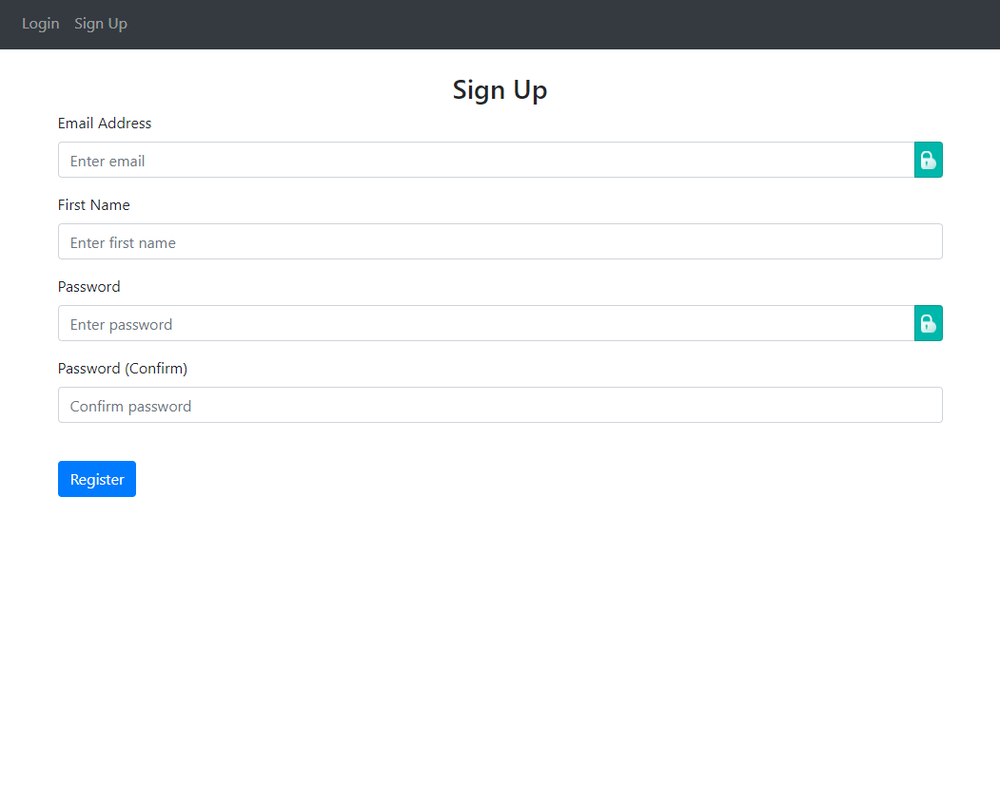
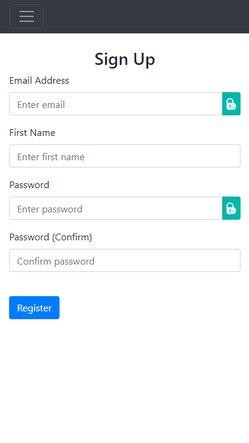

# py-flask-web-app
Simple python based web application. Demonstrates creating user accounts, creating and deleting user data, user authentication and basic website templating using Flask.

Hosted on heroku here: ...

Check my portfolio of other projects here: https://portfolio-site-a770f.web.app/

## Screenshot of app on desktop

## Screenshot of app on mobile

